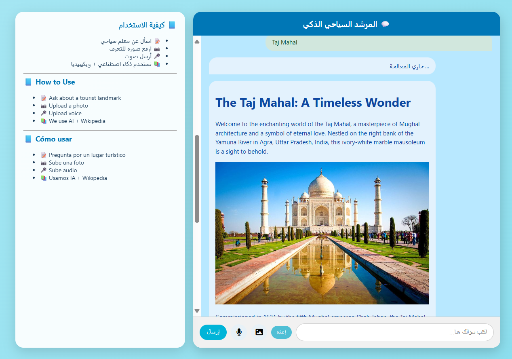

# 🧭 Smart Tourist Guide

Smart Tourist Guide is an AI-powered assistant designed to help tourists identify and learn about landmarks using multimodal input: text, image, or voice. The system leverages modern LLM techniques, RAG (Retrieval-Augmented Generation), and image/audio processing to deliver informative and natural responses in English and Arabic.

 
---

## Demo 
[Final_Project_SDA_2025 Demo Link](https://drive.google.com/drive/folders/16fYRv0umD3qJ9ya_1KpYnOPPTQs99NpJ?usp=sharing)

## 🚀 Features

- 🖼️ Landmark recognition from images using CLIP
- 🗣️ Voice input support using speech-to-text and text-to-speech
- 🧠 Natural language answers powered by GPT (via LangChain)
- 🔍 Wikipedia and custom RAG-based retrieval
- 🌍 Automatic language detection (Arabic & English)
- 💬 Interactive web interface built with Flask

---

## 🛠️ Tech Stack

- Python 3.10+
- LangChain + OpenAI GPT-4
- CLIP (Image recognition)
- FAISS (Vector search for RAG)
- Google Speech Recognition
- gTTS (Text-to-Speech)
- Flask (Web app framework)
- HTML, CSS (Frontend)

---

---

## 🧪 Example Use Cases

- A user uploads an image of a landmark → system returns the name + description.
- A user asks via voice: "When was the Burj Khalifa built?" → system answers with year & context.
- A user types: "Tell me about the Eiffel Tower" → system fetches rich info using RAG.

---

## 🧠 How It Works

1. User provides input (text/image/voice)
2. Input type is detected automatically
3. For images → CLIP identifies landmark
4. For voice → Transcribed via Google Speech Recognition
5. For all → RAG pipeline generates a final answer using:
   - Custom knowledge base (chunked)
   - Wikipedia fallback
   - Google Search (if no results)

---

---

## 📊 Future Enhancements

- Offline mode with preloaded knowledge
- Mobile-friendly UI
- More advanced entity disambiguation
- Integration with Google Maps or GPS
- Real-time camera landmark detection

---

## 👨‍💻 Team

- Developed by: [OceanCore : Abdulrahim Aljadani - Taif Aladwni ]
- Powered by: OpenAI, LangChain, Wikipedia, and the community

---

💡 Contributions are welcome!

